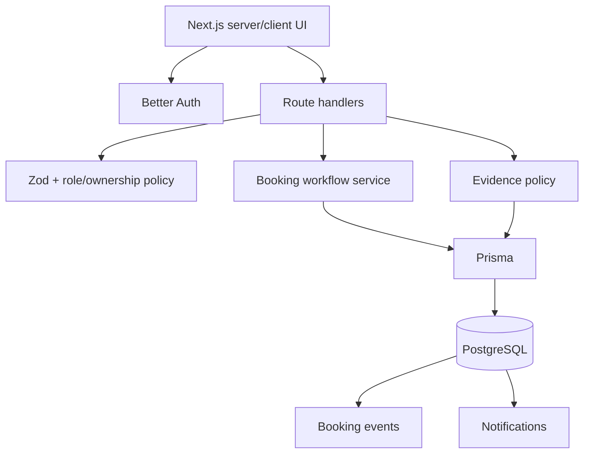

# Architecture

## Product boundary

Repair Desk is a multi-city service workflow platform rather than a simple artisan directory. Its central domain object is a booking with an explicit lifecycle, ownership, assignment, quote, evidence, and handover record.

## Application boundaries

## Workflow invariant

The UI never writes booking status directly. Status changes pass through server-side actions that validate:

1. authenticated actor;
2. actor role;
3. booking ownership or artisan assignment;
4. current lifecycle state;
5. target transition;
6. concurrency-safe conditional update.

The resulting state change and audit event are persisted transactionally in the workflow layer.

## Roles

### Client
Creates requests, reviews quotes, uploads permitted evidence, tracks work, and confirms handover.

### Artisan
Receives assigned work, submits quotes, records diagnosis/completion evidence, starts repairs, and marks work finished.

### Operator
Reviews the queue, receives new-request notifications, and assigns only active artisans whose city and service coverage match the booking.

## Data model decisions

### Multi-city
`City` is a first-class record. `ArtisanCity` is many-to-many coverage and `Booking.cityId` fixes the service location for each job.

### Service coverage
`ArtisanService` separates artisan capability from individual bookings. Assignment requires both city and service eligibility.

### Audit trail
`BookingEvent` records important user and workflow actions independently from the current booking state.

### Notifications
`Notification` is intentionally an in-app persistent notification model. Email/push providers can be added later without coupling the lifecycle to an external vendor.

### Evidence
`BookingEvidence` stores small portfolio-demo files directly in PostgreSQL. Access is always checked through the parent booking. A larger production deployment should place binary content in object storage and retain metadata in PostgreSQL.

## Operational profile

- Node.js 22+
- Next.js 16 App Router
- PostgreSQL
- Prisma 7
- Free Render-compatible deployment
- Stateless web process; persistent state lives in PostgreSQL
- `/api/health` health endpoint

## Testing strategy

- Vitest: pure workflow/state/validation policy
- TypeScript: compile-time contract checks
- ESLint: static quality checks
- Next.js production build: framework integration
- Playwright: public browser smoke tests
- GitHub Actions: all quality gates on PRs and main

## Deliberate limitations

- No payment processor yet.
- In-app notifications only; no email/SMS delivery.
- Evidence binary storage is optimized for a low-volume portfolio demo, not large production workloads.
- Browser tests are smoke-level rather than full authenticated lifecycle automation.
- `prisma db push` is used for the free demo deployment; a commercial production rollout should use reviewed versioned migrations.
