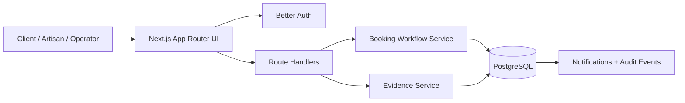

# Repair Desk

[](https://github.com/Olatomii/repair-desk/actions/workflows/ci.yml)

**Live demo:** https://repair-desk-5jcz.onrender.com

Repair Desk is a full-stack, multi-city repair-service workflow platform for requesting repairs, assigning verified artisans, agreeing quotes before work begins, recording repair evidence, and confirming handover.

It began as an interactive proof of concept and has been rebuilt as a production-oriented portfolio application with persistent data, role-based authorization, transactional workflow rules, automated tests, CI, and deployment configuration.

## Why this project exists

Local repair work is often coordinated through calls and chat messages, which makes it difficult to answer simple questions: Who owns the job? What price was agreed? Has work started? What evidence exists? Has the customer accepted the handover?

Repair Desk turns those questions into an auditable workflow.

## Core workflow

```text
REQUESTED
   ↓ operator assigns an eligible artisan
ASSIGNED
   ↓ artisan submits quote
QUOTED
   ↓ client approves
QUOTE_APPROVED
   ↓ artisan starts work
IN_PROGRESS
   ↓ artisan uploads completion evidence and finishes work
AWAITING_HANDOVER
   ↓ client confirms handover
COMPLETED
```

A rejected quote returns to `ASSIGNED` for revision. `CANCELLED` and `DISPUTED` are reserved exceptional paths.

## Features

### Client
- Email/password registration and sign-in
- City and service selection
- Repair request creation
- Booking history and activity timeline
- Quote approval or revision request
- Before-repair/document evidence uploads
- Secure evidence viewing
- Handover confirmation
- In-app notifications

### Artisan
- Role-scoped work dashboard
- Assigned-job visibility
- Quote submission
- Diagnosis/document evidence uploads
- Repair start and finish controls
- After-repair evidence uploads
- In-app notifications

### Operator
- Operations dashboard and queue metrics
- New-request notifications
- Eligibility-aware artisan assignment
- City/service coverage checks
- Evidence visibility

### Platform engineering
- Server-enforced role authorization
- Transactional and conditional booking state transitions
- Persistent audit/event history
- Multi-city data model
- PostgreSQL-backed evidence storage with strict file limits
- Security response headers
- Unit tests with Vitest
- Authenticated workflow and browser regression tests with Playwright
- GitHub Actions CI
- Docker Compose local database
- Render deployment blueprint

## Architecture



Important workflow changes are not arbitrary UI updates. The server validates the actor, ownership/assignment, current booking state, and requested transition before persistence.

## Multi-city design

Abeokuta, Ogun State is the launch city, but the product name and schema are not city-specific. Cities are first-class records, artisans can cover many cities, and every booking belongs to one city. New cities can therefore be added without restructuring the product.

## Evidence model

Repair evidence is intentionally small and self-contained for the portfolio deployment:

- Supported: JPG, PNG, WebP, PDF
- Default maximum: 2 MB per file
- Stored in PostgreSQL for the demo
- Access is authorized against the booking before download
- Clients, artisans, and operators have different upload permissions
- Evidence type is restricted by booking lifecycle stage

For a high-volume production system, the binary payload would move to object storage while PostgreSQL retained metadata and authorization state.

## Stack

- Next.js 16 / React 19
- TypeScript
- Tailwind CSS 4
- PostgreSQL
- Prisma ORM 7
- Better Auth
- Zod
- Vitest
- Playwright
- GitHub Actions
- Docker Compose
- Render

## Local development

Requirements: Node.js 22+ and Docker.

```bash
cp .env.example .env
docker compose up -d
npm ci
npm run db:generate
npm run db:deploy
npm run db:seed
npm run dev
```

Open `http://localhost:3000`.

### Create test roles

Register accounts through the UI first, then promote them locally:

```bash
npm run user:role -- artisan@example.com ARTISAN
npm run user:role -- operator@example.com OPERATOR
```

Promoting an artisan also creates/activates the artisan profile and links it to all currently active launch cities and services for convenient local testing.

## Quality checks

```bash
npm run lint
npm run typecheck
npm test
npm run build
npx playwright install chromium
npm run test:e2e
```

CI starts isolated PostgreSQL and runs Prisma generation, linting, TypeScript checks, unit tests, a production build, and authenticated Chromium workflow tests for pull requests and pushes to `main`.

## Deployment

`render.yaml` defines a free Render web service and free Render Postgres instance. Startup runs only the web process. Initialize a new database explicitly before its first deployment; see [deployment operations](DEPLOYMENT.md). `/api/health` verifies database connectivity. Free databases expire, so this configuration is for a temporary demo.

Production deployment: https://repair-desk-5jcz.onrender.com

Set `BETTER_AUTH_URL` to the final HTTPS service URL. Secrets are never committed to the repository.

See [the bug audit](AUDIT.md) for verified fixes and remaining limitations. Existing browser tabs should be refreshed after the audit release: booking creation now requires a client-scoped idempotency key, and workflow actions require the displayed booking's update timestamp.

## Security and scope

- Server-side role and ownership checks are authoritative.
- Evidence files are MIME/size constrained and served with `nosniff`.
- Runtime secrets live in environment variables.
- The application uses sample or consented data during portfolio development.
- No real payments are processed yet.
- This is a portfolio product, not an SLA-backed commercial marketplace.

## Repository guide

- `src/app/` — UI and route handlers
- `src/lib/booking-workflow.ts` — transactional repair lifecycle
- `src/lib/booking-state.ts` — allowed state transitions
- `src/lib/evidence.ts` — evidence policy and validation
- `prisma/schema.prisma` — relational model
- `tests/` — unit tests
- `e2e/` — browser smoke tests
- `ARCHITECTURE.md` — technical boundaries and design decisions
- `LIFECYCLE.md` — workflow rules
- `PORTFOLIO_CASE_STUDY.md` — concise project case study

## License

MIT
